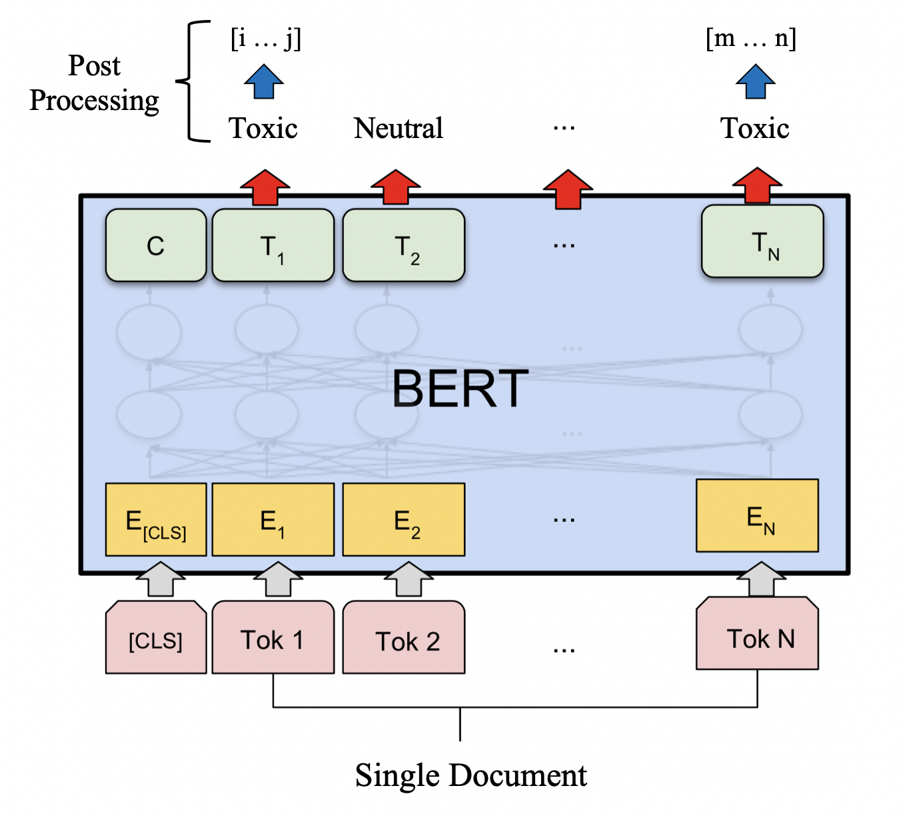

# Toxic Spans Detection (SemEval-2021 Task 5)

## Introduction
This is the code accompanying our submission to SemEval-2021 Task 5.

For a detailed description of the technical details and experimental results, please refer to our paper: 

[Lone Pine at SemEval-2021 Task 5: Fine-Grained Detection of Hate Speech Using BERToxic](https://arxiv.org/abs/2104.03506)

Yakoob Khan, Weicheng Ma, Soroush Vosoughi 

Dartmouth College


## Abstract
This paper describes our approach to the Toxic Spans Detection problem (SemEval-2021 Task 5). We propose BERToxic, a system that fine-tunes a pre trained BERT model to locate toxic text spans in a given text and utilizes additional post-processing steps to refine the boundaries. The post-processing steps involve (1) labeling character offsets between consecutive toxic tokens as toxic and (2) assigning a toxic label to words that have at least one token labeled as toxic. Through experiments, we show that these two postprocessing steps improve the performance of our model by 4.16% on the test set. We also studied the effects of data augmentation and ensemble modeling strategies on our system. Our system significantly outperformed the provided baseline and achieved an F1 score of 0.683, placing Lone Pine in the 17th place out of 91 teams in the competition.

<p align="center">
    
</p>

## Usage
Here's a link to a sample [Google Colab Jupyter Notebook](https://colab.research.google.com/drive/10l7F0D9vjrE8ASfH0qNPLPBTYGmkxw1Z?usp=sharing) that utilizes this code for toxic spans detection.

To fine-tune the BERToxic system for the toxic spans detection, enter the following:

```
python3 './train_bert.py' 
  --model_type 'bert-base-cased' \
  --train_dir '../data/tsd_train.csv' \
  --dev_dir '../data/tsd_trial.csv' \
  --test_dir '../data/tsd_test.csv' \
  --epochs 2 \
  --warm_up_steps 500 \
  --learning_rate 5e-5 \
  --weight_decay 0.01 \
  --batch_size 16
```


## Dependencies
All experiments were ran on Google Colab Pro's High-RAM environment using a single P100 GPU. See [requirements](src/requirements.txt) for complete list of all dependencies used and their respective versions.


## Attribution
The [mt-dnn](./mt-dnn) code was obtained from [Liu et al.](https://github.com/namisan/mt-dnn) and the [task\_organizers\_code](./src/task_organizers_code) was obtained from [Pavlopoulos et al.](https://github.com/ipavlopoulos/toxic_spans/). 

The remaining code in this repository was developed by Yakoob Khan.


## Citation

If you find this code or our paper useful, please consider citing:

```
@misc{khan2021lone,
  title={Lone Pine at SemEval-2021 Task 5: 
  Fine-Grained Detection of Hate Speech Using BERToxic}, 
  author={Yakoob Khan and Weicheng Ma and Soroush Vosoughi},
  year={2021},
  eprint={2104.03506},
  archivePrefix={arXiv},
  primaryClass={cs.CL}
}
```

## References
* [Task Description](https://sites.google.com/view/toxicspans)
* [Task Organizers Code](https://github.com/ipavlopoulos/toxic_spans)
* [Codalab](https://competitions.codalab.org/competitions/25623#learn_the_details-overview)


